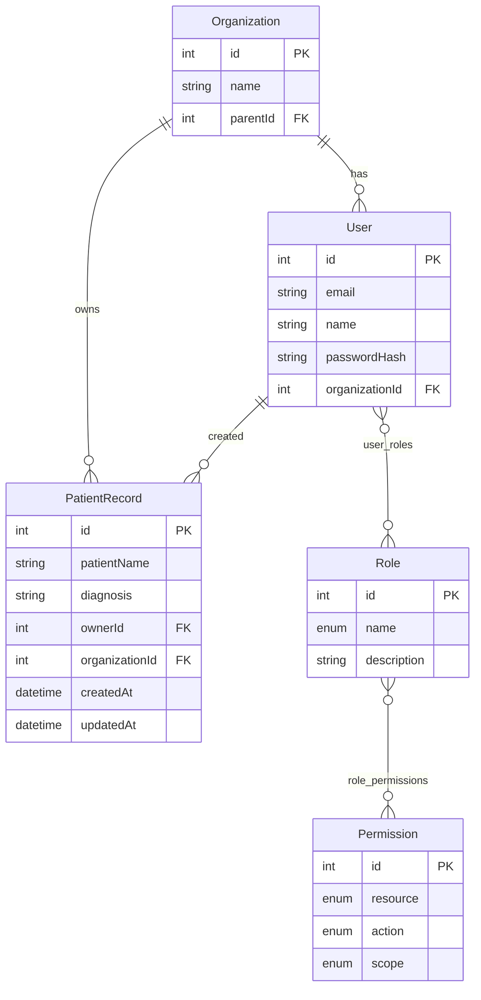

# Entity Relationship Diagram

> **Legend**  
> - `PK` — Primary Key  
> - `FK` — Foreign Key  
> - `enum` — restricted value set  

This diagram reflects the simplified RBAC system required for the TurboVets test assignment.
